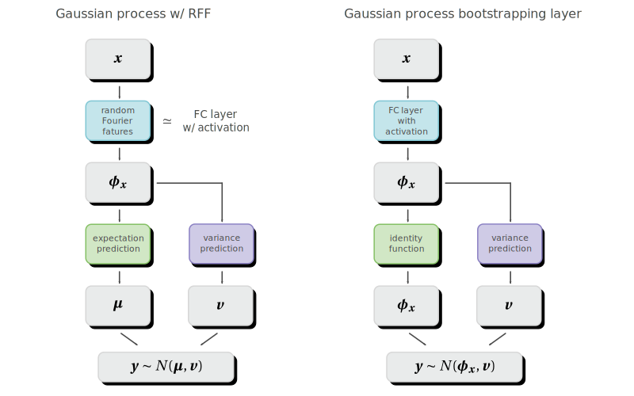
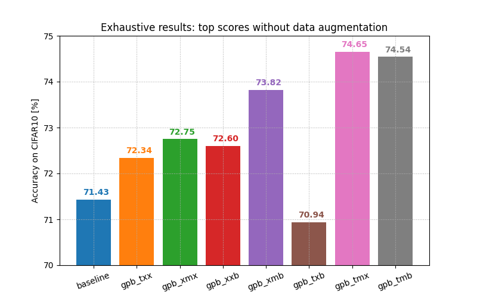
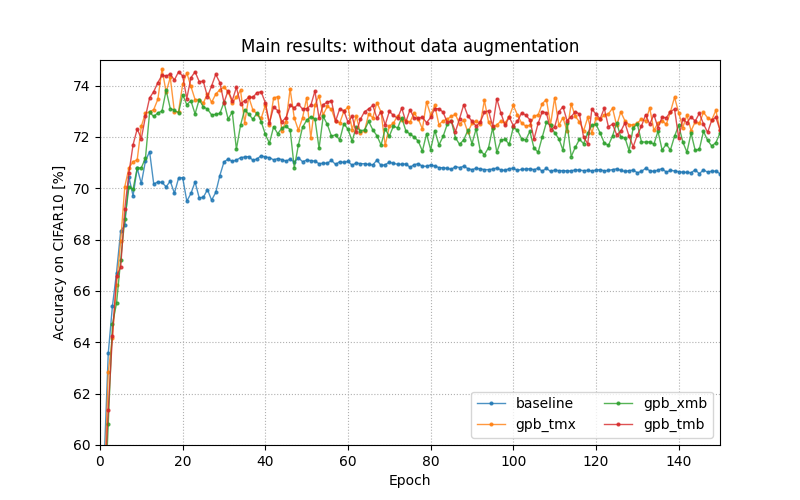
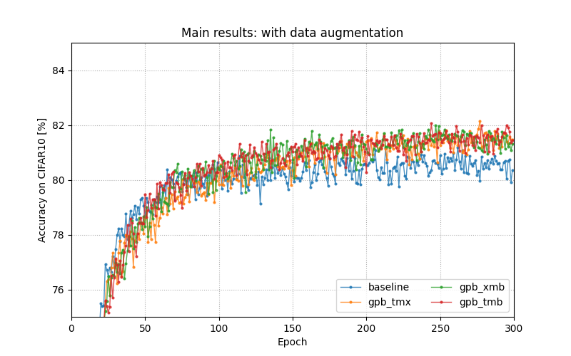
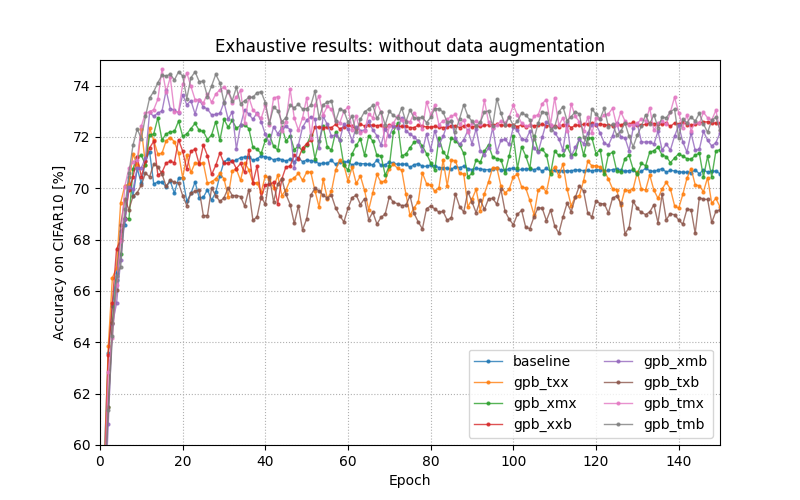
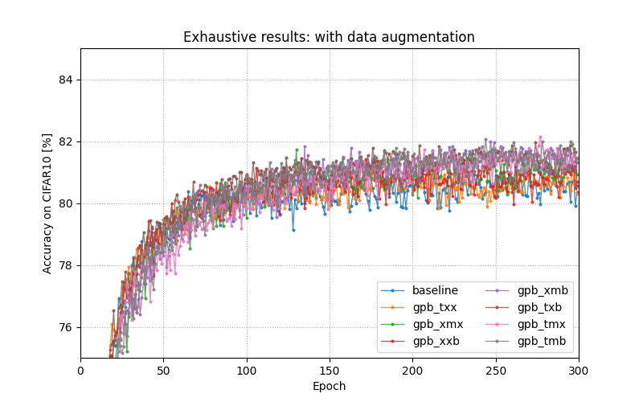
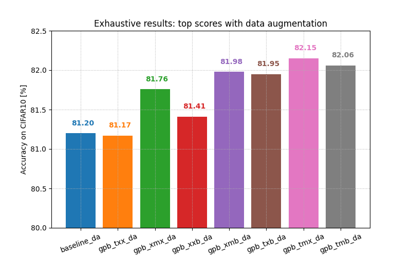
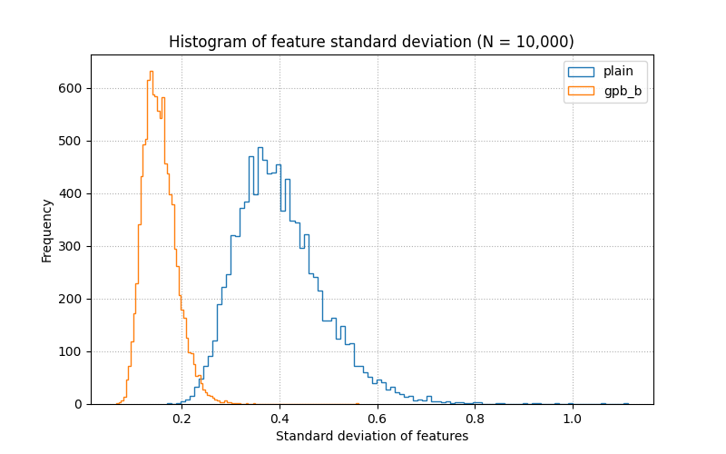

# Gaussian Process Bootstrapping Layer

This repository proposes a Gaussian process bootstrapping layer (GPB layer),
a new bootstrapping layer that improves the generalization performance of
neural networks and is applicable for various types of networks.

Our GPB layer is inspired by the Gaussian process model [1] and random Fourier features [2].
The Gaussian process with random Fourier features can be regarded as 3 layers neural network
with an activation function. Therefore, by imitating the structure of the Gaussian process,
we can extend the layer of the neural network to compute the variance of intermediate features.
Our GPB layer applies bootstrapping based on the variance in the training process.

We also observed that our GPB layer improved the performance in LeNet-5 on CIFAR10.

<div align="center">
    
    
</div>


## Theoretical details

The Gaussian process with random Fourier features can be regarded as a variant of
a fully connected layer. Beased on this analogy, the GPB layer was designed where
the GPB layer has a functionality to compute a variance of input features.
See [this document](documents/gaussian-process-bootstrapping-layer.pdf) for more details.

## Implementation details

### Training/test script

For train a LeNet-5 with GPB layer, run `train.py`. For example, the following code run
a training of a LeNet-5 with GPB layer only at bottom position with data augmentation.
```console
$ python3 train.py --data_aug --gpb_layer_pos bottom
```

For replicating all our results, run the following command:
```console
$ sh run.sh
```

### Pseudo code of the GPB layer

```python
class GaussianProcessBootstrappingLayer:
    """
    PyTorch-like pseudo code of the GPB layer.
    """
    def forward(X, sigma, alpha, skip):
        """
        Forward inference of GPB layer.

        Input:
            X: tensor with shape (N, C)
        Output: 
            Y: tensor with shape (N, C)
        Hyperpatameters:
            sigma: standard deviation of observation error
            alpha: coefficient for exponential moving average
            skip: number of steps to skip bootstrapping
        """
        # Update matrix P with exponential moving average.
        P = alpha * (X.T @ X) + (1.0 - alpha) * P 

        # Compute matrix M.
        M = I - P @ (I - inv(P + sigma^2 * I) @ P) / (sigma^2)

        # Compute variance v[n].
        for n in [0, N):
            v[n] = X[n, :].T @ M @ X[n, :]

        # Add perturbation to the input tensor X.
        for n in [0, N):
            Y[n, :] = X[n, :] + sqrt(v[n]) * (sampling_from_normal_distribution_with_shape(1, C))

        return Y
```

In the above code, `@` denote matrix multiplication and `.T` denote matrix transpose.


## Results

### Main results

We implemented the GPB layer in [PyTorch](https://pytorch.org/) and evaluated
the performance of the GPB layer under the following conditions:

- Dataset: [CIFAR10](https://www.cs.toronto.edu/~kriz/cifar.html) [3]
- Base model: [LeNet-5](http://vision.stanford.edu/cs598_spring07/papers/Lecun98.pdf) [4]
- Optimizer: Adam (`lr=1.0E-3`) [5]
- Data augmentation: Random crop and random horizontal flip

In our experiments, the performance of LeNet-5 with the GPB layer exceeds plain LeNet-5 on CIFAR10
regardless of the presence of data augmentation. See the following figures.
For example, `gpb_xmb` means a LeNet-5 with GPB layers at middle and bottom locations (`x` means unused).

<div align="center">
    
    
</div>

The `baseline` in the above figure is a plain LeNet-5, and all of the `gpb_tmx`, `gpb_xmb` and `gpb_tmb`
are LeNet-5 with the GPB layers, but the number and location of the GPB layers are different.
See the next section for the details of the network architecture.

### Exhaustive results

LeNet-5 have 3 candidate locations for inserting the GPB layer:

- top: before the 2nd convolution layer,
- middle: before the 1st fully connected layer,
- bottom: before the last fully connected layer.

We tried all combinations of the above locations and checked the performance on CIFAR10 dataset.
The following figure is a summary of the results. For example, `gpb_xmb` means a LeNet-5 with
GPB layers at middle and bottom locations (`x` means unused).

The followings are the observations from the experiments:

- Too many GPB layers sometimes make the training much slower than the baseline.
- Adjacent GPB layer (i.n. top&middle or middle&bottom) tend to be slow training.
  In the case of data augmentation, we need to think that the data augmentation has the same effect
  as the GPB layer with a very early layer.

<div align="center">
    
    
</div>

<div align="center">
    
    
</div>

### Variance of intermediate features before/after the GPB layer

The following figure shows the histogram of the standard deviation of intermediate features
computed by the GPB layer inserted at the "bottom" position in LeNet-5 for several pre-trained weights.
We can see that the GPB layer has an effect to reduce the variance of intermediate features.

<div align="center">
    
</div>

## Reference

[1] C. Rasmussen and C. Williams, “Gaussian Processes for Machine Learning”, MIT Press, 2006. <br>
[2] A. Rahimi and B. Recht, "Random Features for Large-Scale Kernel Machines", NIPS, 2007. <br>
[3] A. Krizhevsky, "Learning multiple layers of features from tiny images", Tech Report, 2009. <br>
[4] Y. Lecun, L. Bottou, Y. Bengio and P. Haffner, "Gradient-based learning applied to document recognition", Proc of the IEEE, 1998. <br>
[5] D. Kingma and J. Ba, "Adam: A Method for Stochastic Optimization", ICLR, 2015. <br>
